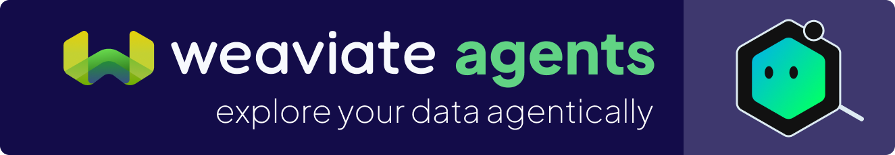

<p align="center">
  
</p>

<p align="center" style="font-size: 1.5em;">
  <a href="https://docs.weaviate.io/query-agent">Docs</a> •
  <a href="https://weaviate-python-client.readthedocs.io/en/latest/weaviate-agents-python-client/docs/modules.html">Reference Guide</a> •
  <a href="https://weaviate.io">Weaviate</a>
</p>

<p align="center">
  <a href="https://github.com/weaviate/weaviate-agents-python-client/actions"></a>
  <a href="https://badge.fury.io/py/weaviate-agents"></a>
</p>


Weaviate Agents allow you to automatically interface with your Weaviate collections without writing any complex code.

## Installation

This package is a sub-package to be used in conjunction with the [Weaviate Python Client](https://github.com/weaviate/weaviate-python-client). Rather than installing this package directly, you should install it as an optional extra when installing the Weaviate Python Client.

```bash
pip install -U "weaviate-client[agents]"
```

If you are having trouble, try to explicitly install/upgrade the agents package via `pip install -U weaviate-agents`.

# Query Agent

The Query Agent turns natural-language questions into precise database operations, making full use of:

* dynamic filters
* cross-collection routing
* query optimization
* aggregations

It returns accurate and relevant results with source citations. It replaces manual query construction and ad-hoc logic with runtime, context-aware planning that optimizes and executes queries across user collections.

## Ask Mode

**Ask mode** is natural-language in and natural-language out. It searches or aggregates your data, depending on the user's query, and then answers the question with respect to the retrieved data. This can be accessed using the `ask()` and `ask_stream()` methods, depending on whether your application needs streaming tokens and progress messages.

```python
from weaviate.agents.query import QueryAgent

qa = QueryAgent(
    client=client, # your Weaviate cloud client
    collections=["FinancialContracts"]
)

res = qa.ask("Find all contracts signed in 2025")
```

## Search Mode

**Search mode** is designed for high quality information retrieval with strong recall and controlled precision, without the final-answer generation. This can be accessed using the `search()` method.

```python
from weaviate.agents.query import QueryAgent

qa = QueryAgent(
    client=client,
    collections=["ECommerce"],
)
search_response = qa.search(
    query="Find me some vintage shoes under $70",
    limit=10,
)
```